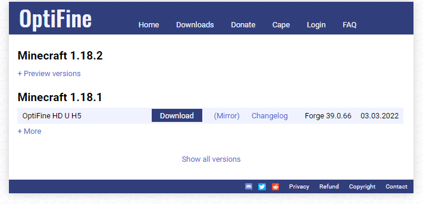
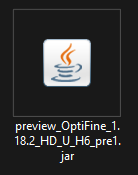
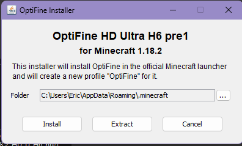

# **Como Instalar OPTIFINE**

Nesse tutorial vamos ensinar como instalar o Optifine no Minecraft.

## **1. Baixar o Optifine**

Acesse o link para encontrar a versão mais recente do Optifine:
[https://optifine.net/downloads](https://optifine.net/downloads)

Clique no botão de download da ultima versão disponível para versão do Minecraft que você deseja instalar.

>**Observação:** É necessário ter iniciado a versão antes de instalar o Optifine.

Você será redirecionado para essa pagina, aguarde os 5 segundos e clique em skip.

Nessa pagina clique em download e salve o arquivo .jar no seu computador.

Ao localizar o arquivo baixado você deve executar nele clicando 2x em cima.

## **2. Instalar o Optifine**

Selecione a pasta .minecraft do seu computador e clique em **Install**.

E pronto seu optifine está instalado!
